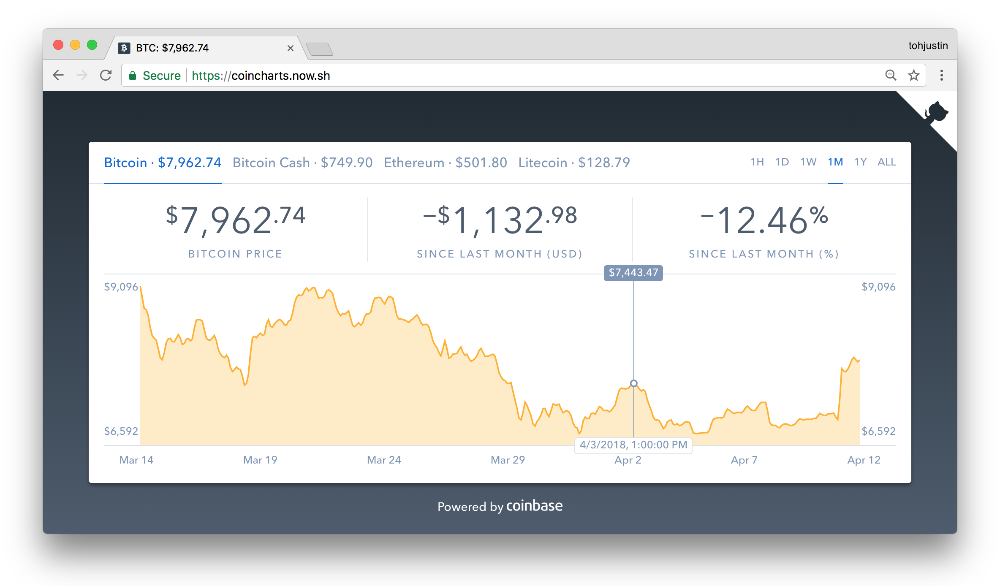

## About


[](https://github.com/tohjustin/coincharts/releases)
[](https://opensource.org/licenses/MIT)

Coincharts is a cryptocurrency price chart based off [Coinbase](https://www.coinbase.com/)'s original price chart on [https://www.coinbase.com/charts](https://web.archive.org/web/20190331085909/https://www.coinbase.com/charts)
and is a [Vue.js](https://vuejs.org/) port built by [okandas](https://github.com/okandas)
  of the [React.js](https://reactjs.org/) app by [tohjustin](https://github.com/tohjustin/coincharts)

<p align="center">
  
</p>

* Bootstrapped with [vue-cli](https://cli.vuejs.org/guide/)
* Built with [Vue.js](https://vuejs.org/), [Vuex](https://vuex.vuejs.org/)\*\*, [Vue-Router](https://router.vuejs.org/)\*\*, , [D3.js](https://d3js.org/)
* Prices retrieved from [Coinbase API](https://developers.coinbase.com/api/v2)


## Getting Started

Start the application's `server`

```shell
yarn start
```


### Packaging

> __NOTE__: Make sure you have updated `.env.build` before proceeding

Create a production build of the application & output the bundle into `/build`

```shell
yarn build
```

### Scripts

#### Downloading API data

Takes a snapshot of responses from coinbase API & saves them into JSON files in `public/priceData` used for offline development

```shell
yarn script:downloadPriceData
```

## License

Coincharts is [MIT licensed](./LICENSE).

[](https://app.fossa.com/projects/git%2Bgithub.com%2Ftohjustin%2Fcoincharts?ref=badge_large)
